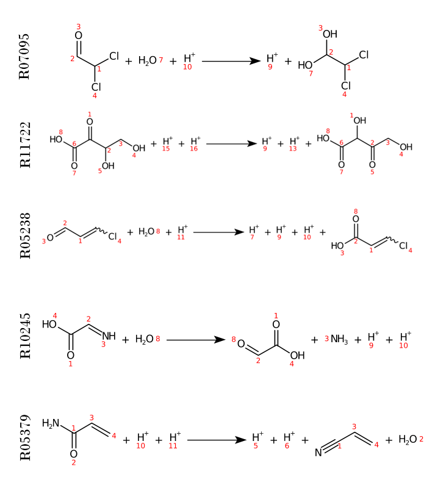

# Demonstration: 5 Reactions

**Estimated runtime:** ~5 minutes  

The following reactions are processed:

<p align="center">
  
</p>

*Note: Other reaction examples may result in significantly longer runtimes.*

---

## Workflow of *laveau*

1. **Step 0:** Translate RDM Code into Graph Format  
2. **Step 1:** Translate RDM Code Graphs into RDM Graphs  
3. **Step 2:** Translate RDM Graphs into Pairwise RDM Pattern  
4. **Step 3:** Translate Pairwise RDM Pattern into Reaction Rules (DPO-Rules)  
5. **Step 4:** Generate Atom-to-Atom Maps from DPO-Rules  

---

## Running the Demonstration

To start the demo, execute:

```bash
sh run_demo.sh
```

## Results

After executing *laveau*, the following **DPO rules** were generated:

<p align="center">
  
</p>

The corresponding **Atom-to-Atom Maps** are shown below:

<p align="center">
  
</p>

